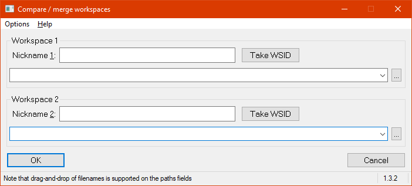

# CompareGUI

Comparison utility designed to compare Dyalog workspaces; This a Windows-only tool.

CompareGUI is a workspace that contains the code needed by the 

```
]CompareWorkpaces
``` 

user command. It requires an external comparison utility: It can call WinCompare and BeyondCompare itself, but in case you prefer a different comparison tool it can also just create two files.

It offers a GUI with a list of all objects only contained in the first or only contained in the second workspace, and a list of all objects that exist in both workspaces but are different. Those can be compared from the list one-by-one.



Note that the GUI supports drag-and-drop: drag a workspace onto on of the path fields for that.


## Installation 

This is a Dyalog user command: download the ZIP file and move its content to the folder

```
C:\Users\{⎕AN}\Documents\MyUCMDs\
```

Start Dyalog 18.0 or later: there is now a user command ]CompareWorkspaces available.

